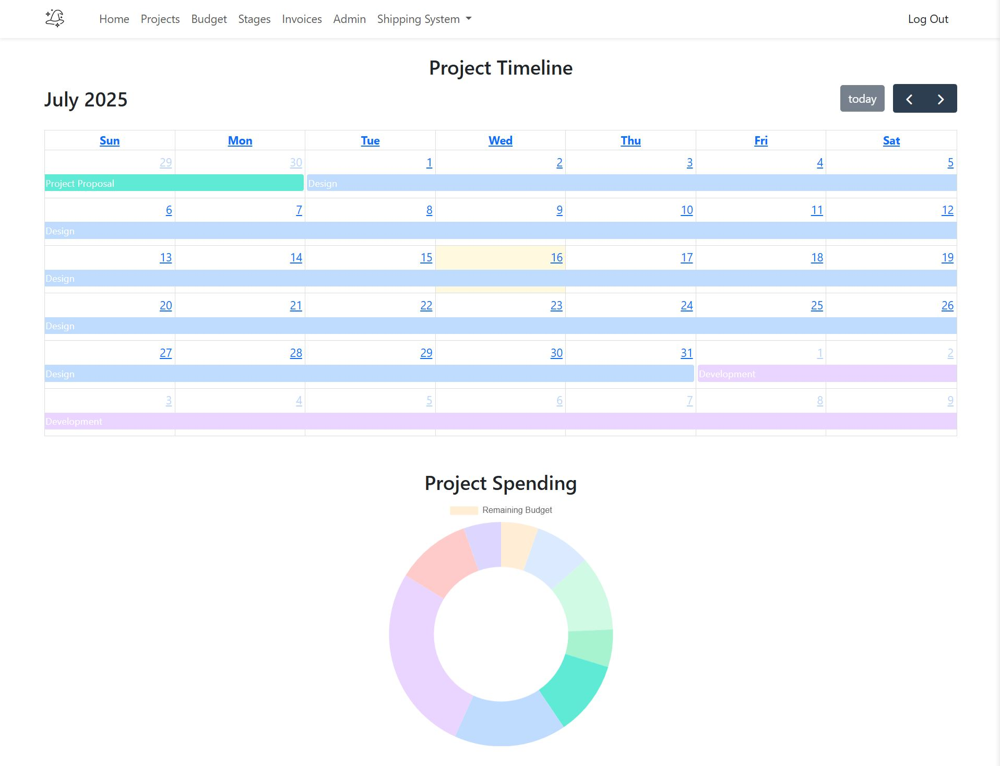
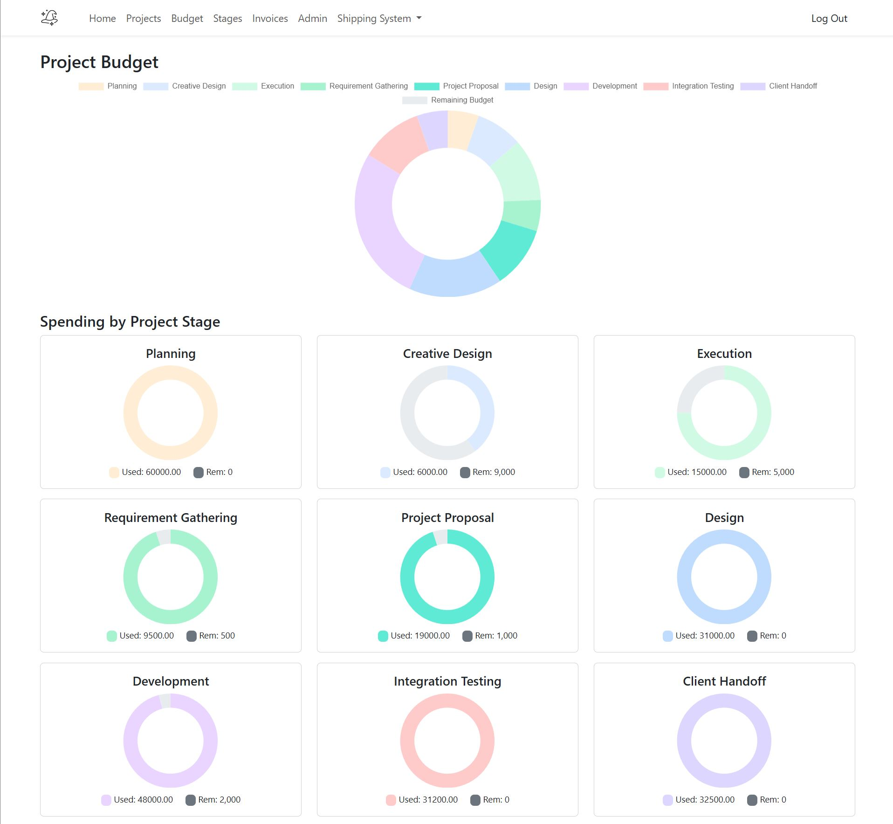
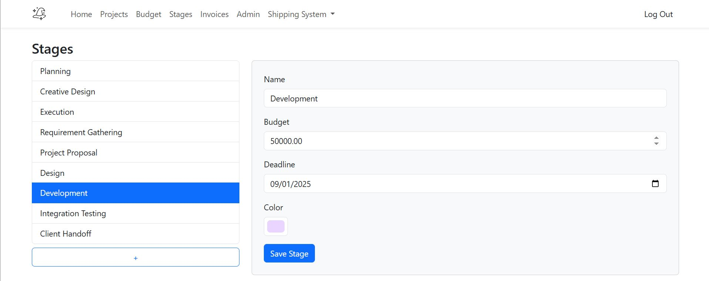
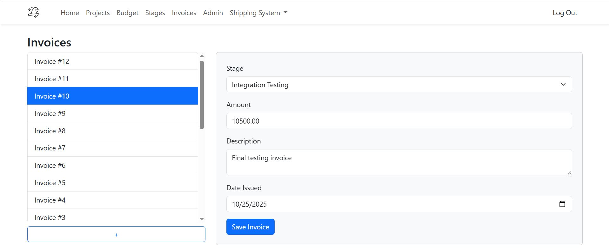
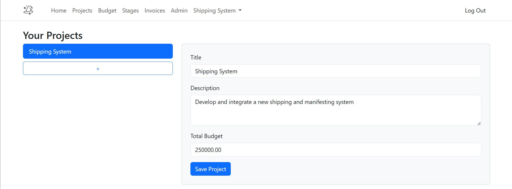
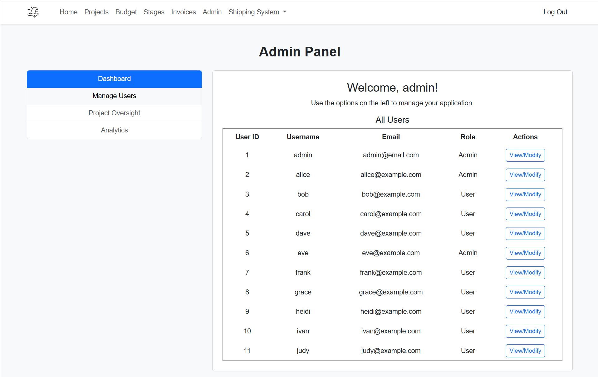
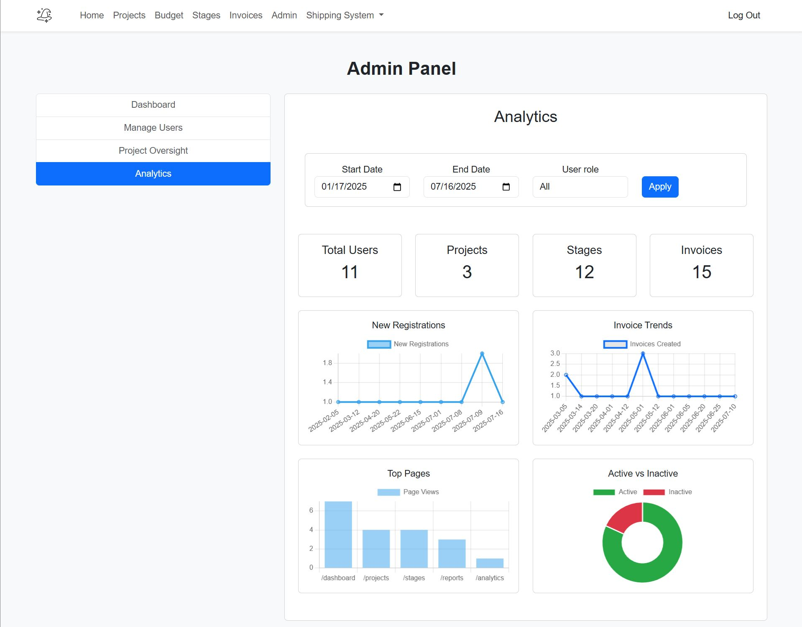

# COP4813-Semester-Project | Group 13 - Project Timeline and Budget Monitor
A web-based tool for managing project stages, deadlines, and budgets in a clear, visual format.

## Overview

The Project Timeline and Budget Monitor is a lightweight, user-friendly web application designed to help project managers and small teams plan, track, and report on project progress and finances. By breaking down projects into customizable stages with individual deadlines and budget allocations, the tool provides a unified dashboard to visualize timelines and monitor spending, ensuring projects stay on schedule and within budget.

## Project Objectives

- **Primary Goal:** Develop a cost-effective, customizable project management solution that simplifies stage-based planning, deadline tracking, and budget oversight.
- **Key Deliverables**:
  - Enable project managers to define and organize project stages with deadlines and cost estimates
  - Provide a visual timeline for quick assessment of project status
  - Offer real-time budget summaries and alerts for potential overruns
  - Facilitate easy reporting and data export for stakeholder communication

## Features

- **Project Entry Form**: Create new projects with title, description, and total budget
- **Stage Management**: Add, edit, and remove stages; assign deadlines and cost estimates per stage
- **Timeline Visualization**: Display stages in a horizontal bar-chart timeline for quick overview
- **Budget Summary**: Track total versus used budget, with warnings for stages exceeding allocated funds
- **Additional Enhancements** (planned): Status labels, deadline alerts, CSV export of reports

## Skills Demonstrated

- **MVC Architecture**: Organized code into Models, Views, and Controllers for maintainability
- **Full-Stack Development**: Built backend logic in PHP and frontend interfaces with HTML, CSS, JavaScript, and Bootstrap
- **Database Design & Management**: Designed relational schema and implemented CRUD operations in MySQL
- **Version Control & Collaboration**: Managed codebase and collaborated via Git and GitHub
- **Team Coordination**: Estimated tasks, allocated workloads, and managed project timeline collaboratively

## Technologies Used

- **Backend**: PHP 7+, Composer for dependency management
- **Frontend**: HTML5, CSS3, JavaScript, Bootstrap 4
- **Database**: MySQL, phpMyAdmin for administration
- **Development Environment**: XAMPP (Apache, MySQL)
- **Tools**: Git, VS Code, phpMyAdmin

## Demo

### Home Page



### Budget Management



### Project Stage Management



### Invoice Management



### General Project Managment



### Admin Dashboard



### Project Users


### User Analytics 



## Installation & Setup

Follow these steps to get the project running locally on Windows using XAMPP:

### 1. Install XAMPP
Download and Install XAMPP to manage the local Apache and mySQL services [apachefriends.org](https://www.apachefriends.org/)

### 2. Install Composer
Download and Install Composer which is used for package management [getcomposer.org](https://getcomposer.org/)
Note: The installer - which requires that you have PHP already installed - will download Composer for you and set up your PATH environment variable so you can simply call composer from any directory.

### 3. Clone the Repository
```bash
git clone https://github.com/isaacjacques/COP4813-Semester-Project.git
```

### 4. Change directory to the cloned repo
```bash
cd COP4813-Semester-Project
```

### 5. Install Dependencies
Install dependencies using the package manager
```bash
composer install
```

### 6. Configure XAMPP
Add the project's directory to the Vhosts configuration file for the apache server.
Edit the file C:\xampp\apache\conf\extra\httpd-vhosts.conf

```apache
<VirtualHost *:80>
    ServerName semesterproject.local
    DocumentRoot "D:/COP4813-Semester-Project/public"
    <Directory "D:/COP4813-Semester-Project/public">
        Options Indexes FollowSymLinks
        AllowOverride All
        Require all granted
    </Directory>
</VirtualHost>
```

### 7. Add the domain name to hosts
Edit C:\Windows\System32\drivers\etc\hosts as an Administrator
Add the same ServerName just defined in the vhosts file to hosts file mapping it to the local host 127.0.0.1
```none 
127.0.0.1   semesterproject.local
```

### 8. Start/Restart Apache
In the XAMPP control panel start or restart the apache server


### 9. Start mySQL
In the XAMPP control panel start the mySQL server

### 10. Configure local mySql database
Navigate to phpmyadmin by selecting the Admin button next to the mySQL service.
Select the SQL tab to copy/paste the sql statements.

#### a. Create Database and Tables
Copy the Create Database and all the Drop/Create table statements from the DDL script:

D:\COP4813-Semester-Project\sql\DDL_Script.sql
```sql
    CREATE DATABASE IF NOT EXISTS project_wizard;
    USE project_wizard;

    DROP TABLE IF EXISTS invoices;
    DROP TABLE IF EXISTS stages;
    DROP TABLE IF EXISTS projects;
    DROP TABLE IF EXISTS users;

    CREATE TABLE users
    ...
```

#### b. (optional) Insert Test Data into Tables
Copy the Insert statements from the DDL script to create test user and data.

D:\COP4813-Semester-Project\sql\DML_Script.sql
```sql
    INSERT INTO users (username, email, password_hash)
    VALUES ('admin', 'admin@email.com', MD5('password'));
    SET @new_user_id = LAST_INSERT_ID();

    INSERT INTO projects (user_id, title, description, total_budget)
    VALUES
    (@new_user_id, 'Shipping System', 'Develop and integrate a new shipping and manifesting system', 250000.00);
    SET @new_project_id = LAST_INSERT_ID();
    ...
```
